# BPbSw-Traceability

This repository integrates tools for implementing a BP based software traceability framework on Camunda Platform with Java language.

## Index

1. [Description](#description)
2. [Applications](#applications)
3. [Prerequisites](#prerequisites)
4. [Tool Usage](#Tool-usage)
   1. [Plugin Installation](#plugin-installation)
   2. [Plugin Usage](#plugin-usage)

## Description

This tool is used to process the BPMN model through its .xml file. It goes through the .xml file and determines the variables used in the model, as well as in which activity each variable is used, it also analyzes the external systems looking for the special annotations created for this project where it defines which variables are used and which activity is referenced in that section of the external system.
Each of this information is extracted in a separate .json file, and then collated to obtain what is called a “trace”, which is stored in a database and when necessary the tool can query depending on the variable and its trace version the information in the database.

[Java](https://www.java.com/es/) is a versatile and widely used programming language known for its platform independence, robustness, and scalability. With its rich ecosystem of libraries and frameworks, Java enables developers to build complex enterprise-grade applications efficiently and reliably.

[Spring initializr](https://start.spring.io/) is a tool that streamlines the creation of Spring Boot projects by integrating various dependencies such as Spring Data JPA, Spring Web, Lombok, Thymeleaf, and DevTools. Spring Boot improves the development process by providing out-of-the-box solutions for common challenges, allowing developers to focus on business logic rather than infrastructure configuration.

[Camunda Modeler](https://camunda.com/download/modeler/) is a desktop application that provides a graphical user interface for designing BPMN and DMN diagrams. It allows users to visually model their business processes and decision tables using drag-and-drop elements, making it easy to create, edit, and analyze process models.

## Applications

1. **annotation**: As part of the business process variable traceability project, some customized annotations were implemented in order to identify how these variables are traced in the source code. Here is the definition of the annotations using a Java project. [Repository Link](https://github.com/BPMN-sw-evol/BPbSw-Traceability/tree/8a90c80e608520e8530627eb171014de5f973bb3/annotation)

2. **apiTraceability**: This module is in charge of giving access to the tool through a REST Api, this module generates a .jar that is used in “plugin” to deploy the api and thus use the tool from Camunda Modeler. Another part of this module is that it allows the creation of the database tables automatically thanks to the JPA library and the entities inside the module. [Repository Link](https://github.com/BPMN-sw-evol/BPbSw-Traceability/tree/8a90c80e608520e8530627eb171014de5f973bb3/apiTraceability)

3. **biptrac**: A program that analyzes the source code of several projects in search of process variables. These variables belong to a BPMN model, which is connected through a business process executed in a Camunda Engine. In other words, the source code of the projects can access what we call process variables either because the Camunda Engine is embedded in the project or by using the Camunda API. With the information from the analysis, a JSON file is generated and used alongside another JSON file produced by "BPM-tracer" to determine the existing traceability between the BPMN model and the external systems. This is done by comparing both JSON files for matches between activities-classes and process variables-code variables — this is what we call a "trace." These traces are then persisted in a MySQL database along with additional information, such as the Data Transfer Object through which the variables travel in the external system, among other details. The database’s ER diagram can be viewed in ([MER Link](https://github.com/BPMN-sw-evol/BPbSw-Traceability/blob/e5c265e47b892391e11be85756053bdd589c2243/doc/DataBase/TraceablityMER.png)). [Repository Link](https://github.com/BPMN-sw-evol/BPbSw-Traceability/tree/8a90c80e608520e8530627eb171014de5f973bb3/biptrac)

4. **BPM-tracer**: Program that analyzes a BPMN model going through its XML to obtain information of the activities of the model, as well as the variables that are used in these, the obtained information generates a .json file that later is used to make the trace. This code is used for models executed in the Camunda engine. [Repository Link](https://github.com/BPMN-sw-evol/BPbSw-Traceability/tree/8a90c80e608520e8530627eb171014de5f973bb3/BPMN-tracer)

5. **dataBase**: Establishes the connections to the database implementing the Singleton pattern of the information that is of interest to analyze. This is used by the “traza” module both to store the trace information and to query them, making use of a manager class that provides the DAO's of the different tables. [Repository Link](https://github.com/BPMN-sw-evol/BPbSw-Traceability/tree/8a90c80e608520e8530627eb171014de5f973bb3/dataBase)

6. **dbInitializer**: This module is in charge of creating the “dbTraceability” database automatically using the default database in postgreSQL and is executed when using the build-and-run.sh. The generated traces are saved in this database. [Repository Link](https://github.com/BPMN-sw-evol/BPbSw-Traceability/tree/8a90c80e608520e8530627eb171014de5f973bb3/dbInitializer)

7. **doc**: This is not a module, it is a file containing documents about the mono-repository, as well as images that feed the readme and the BPMN of the case study. [Repository Link](https://github.com/BPMN-sw-evol/BPbSw-Traceability/tree/8a90c80e608520e8530627eb171014de5f973bb3/doc)

8. **plugin**: It contains the plugin designed for Camunda Modeler where the traceability tool will be used by the developers. Once the plugin is in the Camunda Modeler, when we click on an activity we will see a tooltip that will show us the variables that are used in this activity, to open the graphical panel of the tool you must click on any of the variables and if there is already a trace for that variable then it will show that information otherwise it proceeds to request the files to create a trace. [Repository Link](https://github.com/BPMN-sw-evol/BPbSw-Traceability/tree/8a90c80e608520e8530627eb171014de5f973bb3/plugin)

9. **traza**: Contains the graphic panel that will be called from the Camunda Modeler in which the information resulting from the traceability analysis is presented, as well as the execution of the modules “BPM-tracer” and “biptrac”, to obtain their respective JSON files for the analysis and creation of the trace. [Repository Link](https://github.com/BPMN-sw-evol/BPbSw-Traceability/tree/8a90c80e608520e8530627eb171014de5f973bb3/traza)

   Grafic panel:
   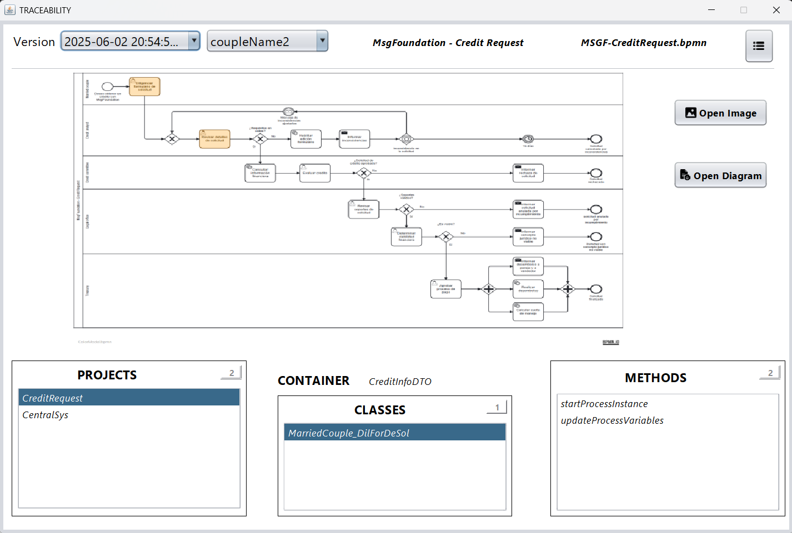

## Prerequisites

### Environment

To use this program you need the following:

1. **Version control system**: Install GIT from the [GIT official website](https://git-scm.com/downloads).

2. **IntelliJ IDEA**: To modify the project, you can download it from the [IntelliJ official website](https://www.jetbrains.com/es-es/idea/download/?section=windows).

3. **Java 21**: You can get help to download and install the java version by following [this link](https://www.youtube.com/watch?v=oAin-q1oTDw&pp=ygUXY29tbyBjb25maWd1cmFyIGphdmEgMTc%3D)

4. **Maven 3.9**: You can get help to download and install the maven version by following [this link](https://www.youtube.com/watch?v=1QfiyR_PWxU&pp=ygUSaW5zdGFsYXIgbWF2ZW4gMy45)

5. **Node.js**: You can to download and install node version from [this link](https://nodejs.org/es)

6. **PostgreSQL** Install PostgresSQL from the [official website](https://www.enterprisedb.com/downloads/postgres-postgresql-downloads).
   - Step 1: Download the version for your operating system.
   - Step 2: In the installation process, leave the default port 5432.
      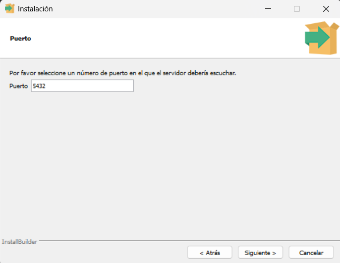
   - Step 3: The username must be "postgres" and the password must be "admin".
      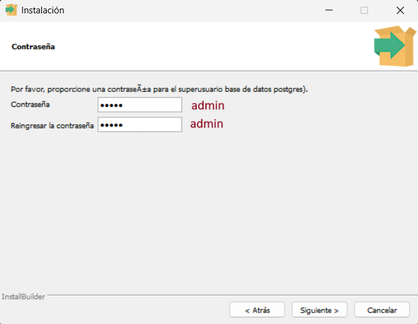

7. **Camunda Modeler**: you can download to install Camunda Modeler here [official website](https://camunda.com/download/modeler/)

### Usage

#### BPMN Model

1. Add inputs and outputs to each activity reflected in the information systems, as long as they are not UserTask with "Generated Task Forms" implementation.
   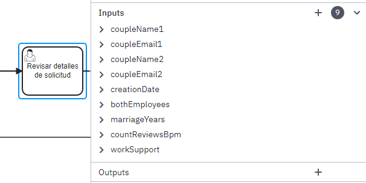

#### Java Projects

1. Make use of the Data Transfer Object (DTO) pattern in information systems.
   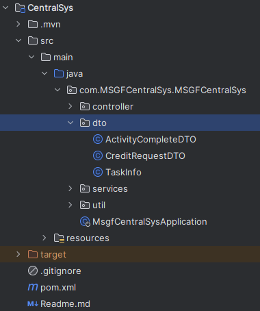

2. Use the following nomenclature for the naming of classes according to the following structure:
   
    **CredictAnalyst_RevDetDeSol**

    **CredictAnalyst**: refers to the lane of the activity that the  external system reflects in the class.
   
    **RevDetDeSol**: refers to the first 3 letters of each word that makes up the name of the activity that the external system reflects in the class.
   
    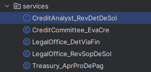
    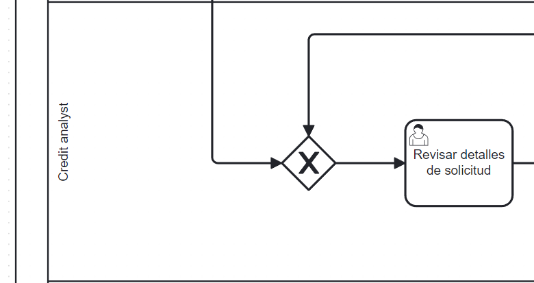


## Tool Usage

### Plugin Installation

To install this plugin you must:

1. Open the Git Bash terminal in the folder where you want to download the program and clone it with the following command:
   ```
   git clone https://github.com/BPMN-sw-evol/BPbSw-Traceability
   ```
2. Once the repository is cloned, open to the folder ```BPbSw-Traceability``` and run the ```build-and-run.sh``` file using the Git Bash terminal:
   ```
   ./build-and-run.sh
   ```

3. Using the same Git Bash terminal run the following command:
   ```
   npm install -g bpmn-to-image
   ```

6. Once the previous step is completed, copy the file ```apiTraceability-1.0-SNAPSHOT.jar``` located in the ```apiTraceability/target/``` folder

   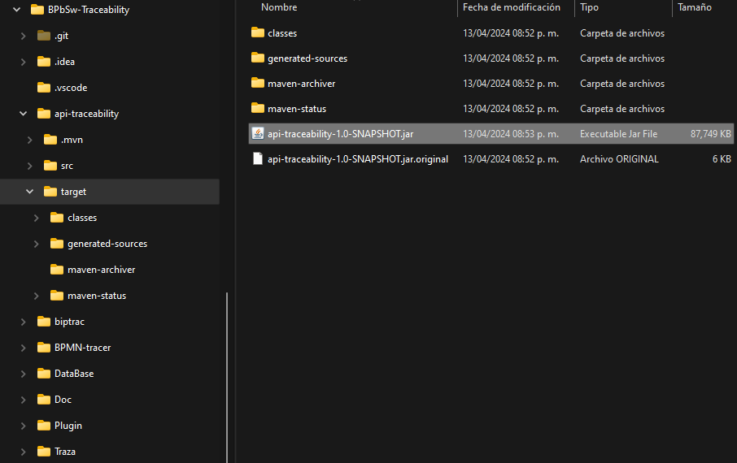

   and paste it inside the ```plugin``` folder.

   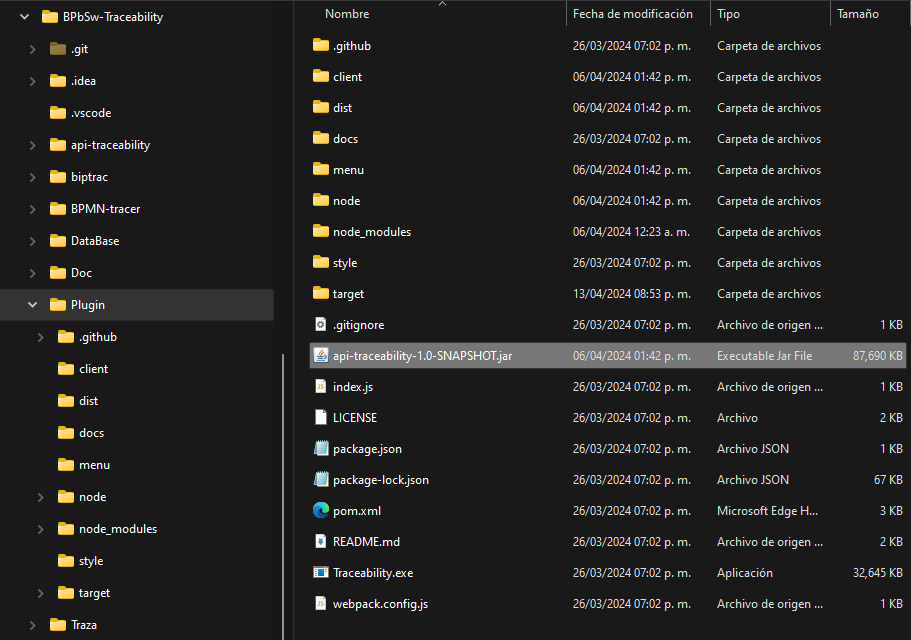

7. Then, copy the ```plugin``` folder located in the folder ```BPbSw-Traceability``` and paste it into the ```resources/plugins``` folder of the Camunda installation directory.
   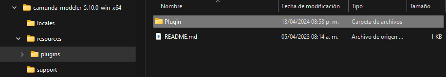

8. You have finished installing the PLUGIN! After these steps, you will be able to interact with the ```BPbSw-Traceability``` tool through the Camunda interface.

### Plugin Usage

To use this plugin you must:

1. Open the ```camunda modeler```.
   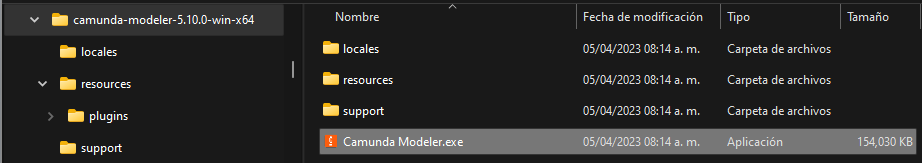

2. We open our model that we are going to analyze, and clicking on any activity we will be able to visualize the tooltip provided by the ``PLUGIN`` just installed.
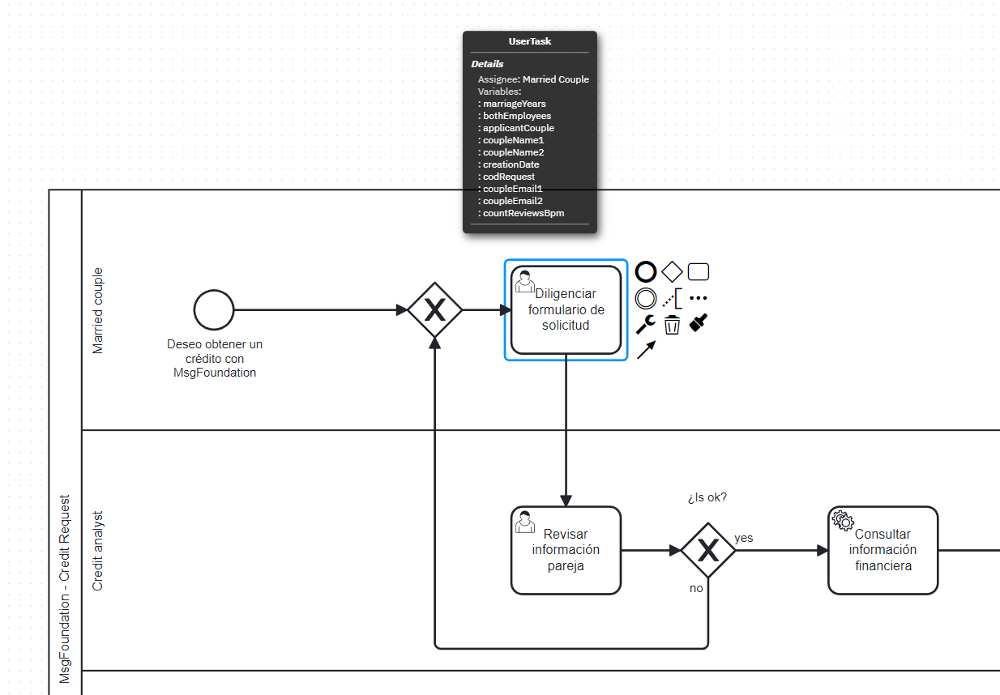
3. By clicking on any of the ``variables`` visible in the tooltip, the traceability tool window will be displayed (if it is the ``first time``, a trace to the desired project will be requested).
   
4. If the desired project is already ``correctly annotated``, click on the ``yes`` option, this option will display the respective file managers: the first one will load the ``.BPMN model`` and the second one will load ``all the projects`` previously annotated.
   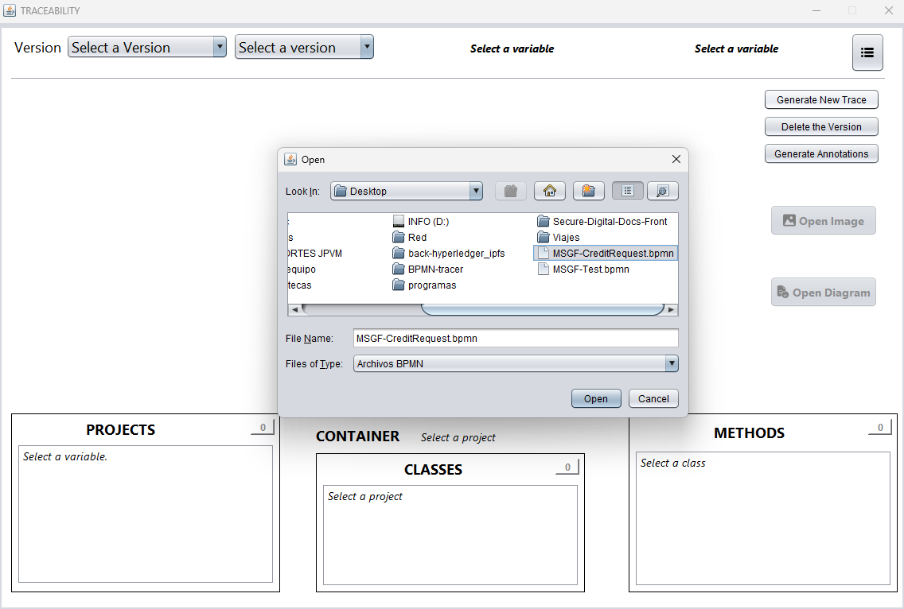
   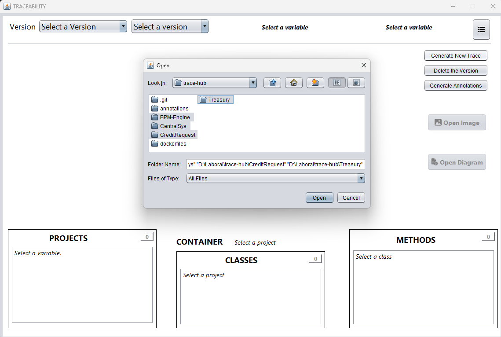
5. Once the traceability process is finished, the tool will show the following information.
   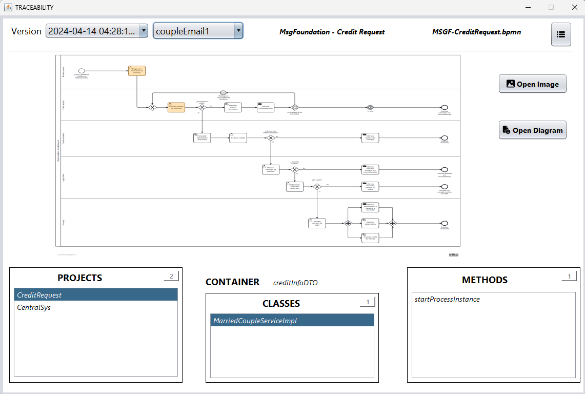

   #### The tool is divided into 3 sections as follows:

   * The first part consists of:
     * The versions of traces that have been made.
     * The variables that have been traced.
     * The name of the Pool.
     * The name of the file that was traced.
     * And a menu button with the options: 
       - **Generate New Trace**: Option used to generate a new trace. 
       - **Delete the Version**: Option to delete a selected version. 
       - **Generate Annotations**: Option to annotate projects
   
   

   * The second part consists of:
     * The visualization of the model pointing out the activities where the selected variable is located.
     * The button to open the image of the visualized model.
     * The button to open the model with the selected activities.

   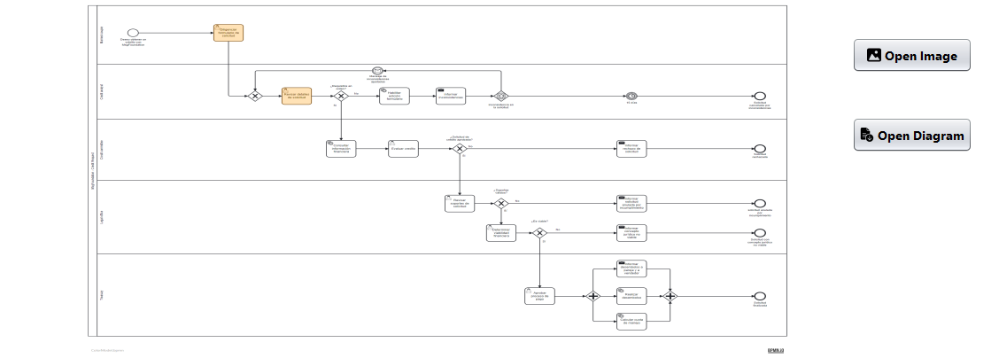
  
   * The third part consists of:
     * A selectable list of PROJECTS where the variable is being used.
     * The structure where the variable is contained in the respective project.
     * A selectable list of CLASSES where the variable is being used.
     * A selectable list of METHODS where the variable is being used.

   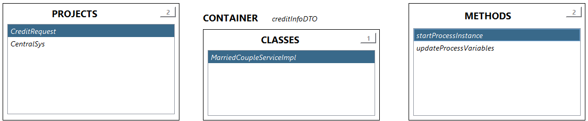
