# BPbSw-Traceability

This repository integrates tools for implementing a BP based software traceability framework on Camunda Platform with Java language.

## Index

1. [Description](#description)
2. [Applications](#applications)
3. [Prerequisites](#prerequisites)
4. [Tool Usage](#Tool-usage)
   1. [Plugin Installation](#plugin-installation)
   2. [Plugin Usage](#plugin-usage)

## Description

The applications created in this implementation were developed using the Java programming language.

[Java](https://www.java.com/es/) is a versatile and widely used programming language known for its platform independence, robustness, and scalability. With its rich ecosystem of libraries and frameworks, Java enables developers to build complex enterprise-grade applications efficiently and reliably.

[Spring initializr](https://start.spring.io/) is a tool that streamlines the creation of Spring Boot projects by integrating various dependencies such as Spring Data JPA, Spring Web, Lombok, Thymeleaf, and DevTools. Spring Boot improves the development process by providing out-of-the-box solutions for common challenges, allowing developers to focus on business logic rather than infrastructure configuration.

[Camunda Modeler](https://camunda.com/download/modeler/) is a desktop application that provides a graphical user interface for designing BPMN and DMN diagrams. It allows users to visually model their business processes and decision tables using drag-and-drop elements, making it easy to create, edit, and analyze process models.
## Applications

1. **BPM-tracer**: program that analyzes a BPMN model by traversing its XML to obtain information that helps developers to evolve the software that supports the model execution. Mainly the execution links of the model activities. This code is used for models executed in the Camunda engine. [Repository Link](https://github.com/BPMN-sw-evol/BPMN-tracer)

2. **biptrac**: program that analyzes the static code of various projects in search of process variables to determine the existing traceability by generating information and persisting it to a MySQL database and in a JSON file. [Repository Link](https://github.com/BPMN-sw-evol/biptrac)

3. **DataBase**: establishes the connections to the database implementing the Singleton pattern of the information that is of interest to analyze. [Repository Link](https://github.com/BPMN-sw-evol/BPbSw-Traceability)

4. **Traza**: contains the graphic panel that will be called from the Camunda Modeler in which the information resulting from the traceability analysis is presented. [Repository Link](https://github.com/BPMN-sw-evol/BPbSw-Traceability)

5. **plugin**: it contains the plugin designed for Camunda Modeler where the behavior of the traceability tool will be managed.[Repository Link](https://github.com/BPMN-sw-evol/BPbSw-Traceability)

6. **api-traceability**: as part of the business process variable traceability project, some customized annotations were implemented in order to identify how these variables are traced in the source code. Here is the definition of the annotations using a Java project. [Repository Link](https://github.com/BPMN-sw-evol/Annotations)

## Prerequisites

### Environment

To use this program you need the following:

1. **Version control system**: Install GIT from the [GIT official website](https://git-scm.com/downloads).

2. **IntelliJ IDEA**: To modify the project, you can download it from the [IntelliJ official website](https://www.jetbrains.com/es-es/idea/download/?section=windows).

3. **Java 21**: You can get help to download and install the java version by following [this link](https://www.youtube.com/watch?v=oAin-q1oTDw&pp=ygUXY29tbyBjb25maWd1cmFyIGphdmEgMTc%3D)

4. **Maven 3.9**: You can get help to download and install the maven version by following [this link](https://www.youtube.com/watch?v=1QfiyR_PWxU&pp=ygUSaW5zdGFsYXIgbWF2ZW4gMy45)

5. **Docker and Docker-Compose**: To use Docker correctly follow the steps below:
    - Step 1: Install Docker from the [official website](https://www.docker.com/products/docker-desktop/).(If you already have Docker Desktop installed, skip this step).
    - Step 2: Create a Docker Hub account from the official website, and log in to Docker Desktop. (If you already have an account, log in directly to Docker Desktop) WSL2: According to your need: Use the following command to install WSL2 wsl --list --o to know the available distributions. wsl --install -d "distribution-version" to install WSL2 with a specific distribution. Use the following command for upgrade to WSL2 wsl --version if you want to know the installed WSL version wsl --set-default-version 2 to change the version to WSL2.
   
6. **Camunda Modeler**: you can download to install Camunda Modeler here [official website](https://camunda.com/download/modeler/)

### Usage

#### BPMN Model

1. Add inputs and outputs to each activity reflected in the information systems, as long as they are not UserTask with "Generated Task Forms" implementation.
   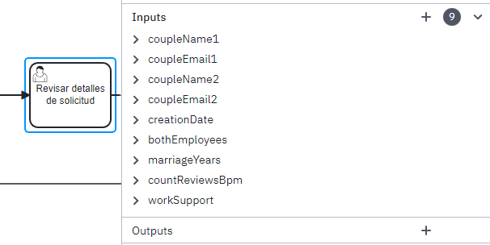

#### Java Projects

1. Make use of the Data Transfer Object (DTO) pattern in information systems.
   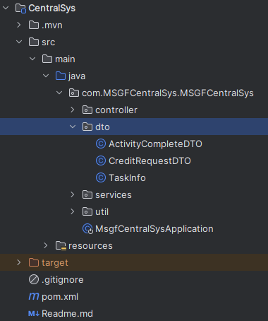

2. Use the following nomenclature for the naming of classes according to the following structure:
   
    **CredictAnalyst_RevDetDeSol**

    **CredictAnalyst**: refers to the lane of the activity that the  external system reflects in the class.
   
    **RevDetDeSol**: refers to the first 3 letters of each word that makes up the name of the activity that the external system reflects in the class.
   
    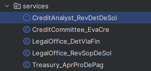
    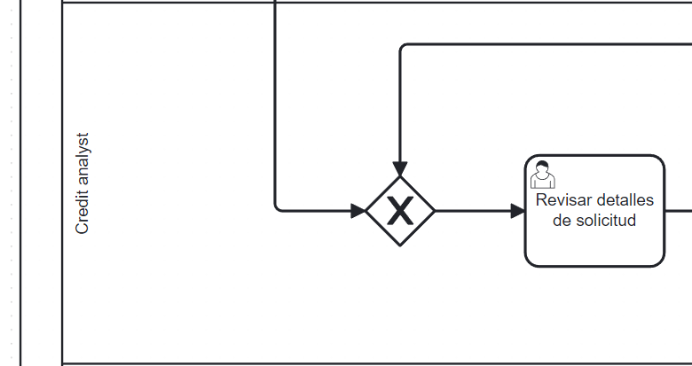


## Tool Usage

### Plugin Installation

To install this plugin you must:

1. Make sure that Docker Desktop is running.

2. Open the Git Bash terminal in the folder where you want to download the program and clone it with the following command:
   ```
   git clone https://github.com/BPMN-sw-evol/BPbSw-Traceability
   ```
3. Once the repository is cloned, open to the folder ```BPbSw-Traceability``` and run the ```build-and-run.sh``` file using the Git Bash terminal:
   ```
   ./build-and-run.sh
   ```
   In case it is not the ```first time``` and you have the Docker image of the database, open ```docker desktop``` and run the ```dbTraceability container```.
   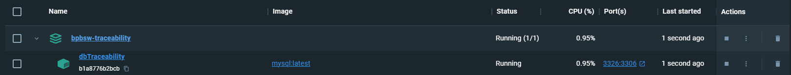


4. Wait while the Database image is being built and its respective container is started. The waiting time may vary depending on the computing power of your system.
   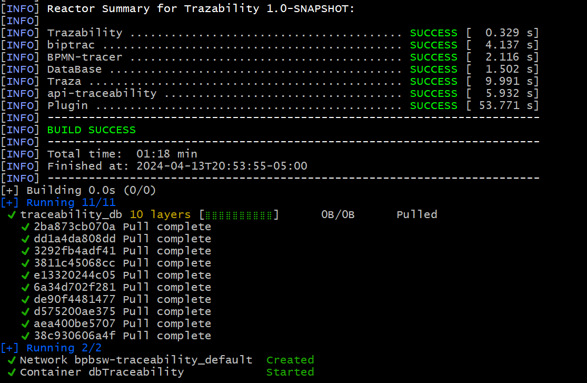

5. Once the previous step is completed, copy the file ```api-traceability-1.0-SNAPSHOT.jar``` located in the ```api-traceability/target/``` folder

   

   and paste it inside the ```plugin``` folder.

   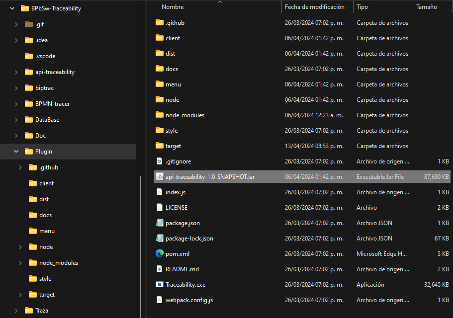

6. Then, copy the ```Plugin``` folder and paste it into the ```resources/plugins``` folder of the Camunda installation directory.
   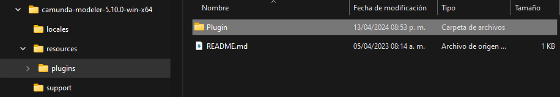

7. You have finished installing the PLUGIN! After these steps, you will be able to interact with the ```BPbSw-Traceability``` tool through the Camunda interface.

### Plugin Usage

To use this plugin you must:

1. Open the ```camunda modeler```.
   

2. We open our model that we are going to analyze, and clicking on any activity we will be able to visualize the tooltip provided by the ``PlUGIN`` just installed.
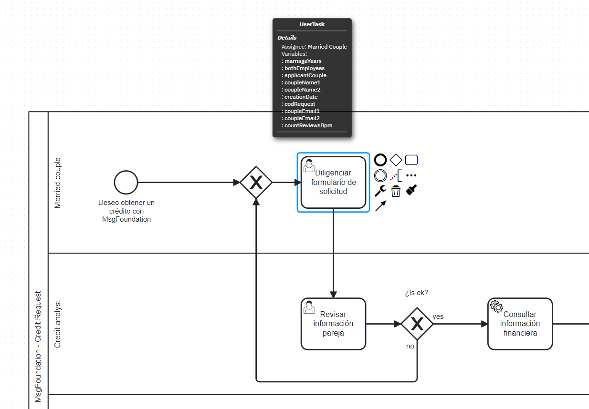
3. By clicking on any of the ``variables`` visible in the tooltip, the traceability tool window will be displayed (if it is the ``first time``, a trace to the desired project will be requested).
   
4. If the desired project is already ``correctly annotated``, click on the ``yes`` option, this option will display the respective file managers: the first one will load the ``.BPMN model`` and the second one will load ``all the projects`` previously annotated.
   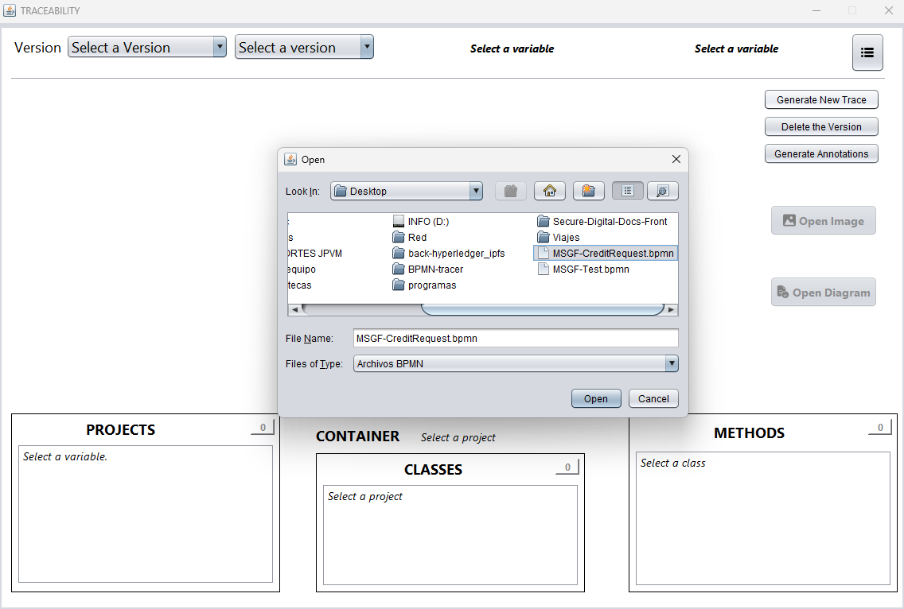
   
5. Once the traceability process is finished, the tool will show the following information.
   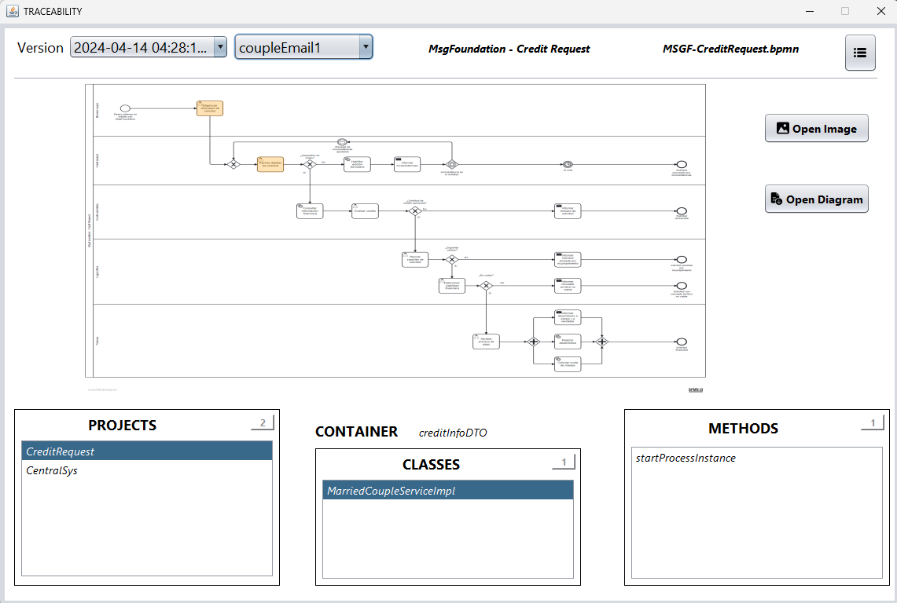

   #### The tool is divided into 3 sections as follows:

   * The first part consists of:
     * The versions of traces that have been made.
     * The variables that have been traced.
     * The name of the Pool.
     * The name of the file that was traced.
     * And a menu button with the options: 
       - **Generate New Trace**: Option used to generate a new trace. 
       - **Delete the Version**: Option to delete a selected version. 
       - **Generate Annotations**: Option to annotate projects
   
   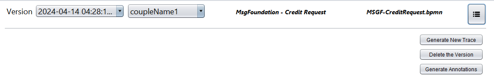

   * The second part consists of:
     * The visualization of the model pointing out the activities where the selected variable is located.
     * The button to open the image of the visualized model.
     * The button to open the model with the selected activities.

   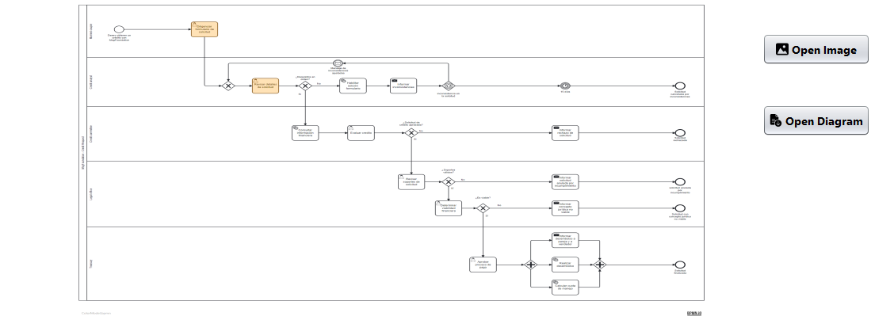
  
   * The third part consists of:
     * A selectable list of PROJECTS where the variable is being used.
     * The structure where the variable is contained in the respective project.
     * A selectable list of CLASSES where the variable is being used.
     * A selectable list of METHODS where the variable is being used.

   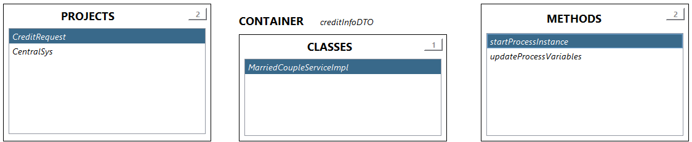
