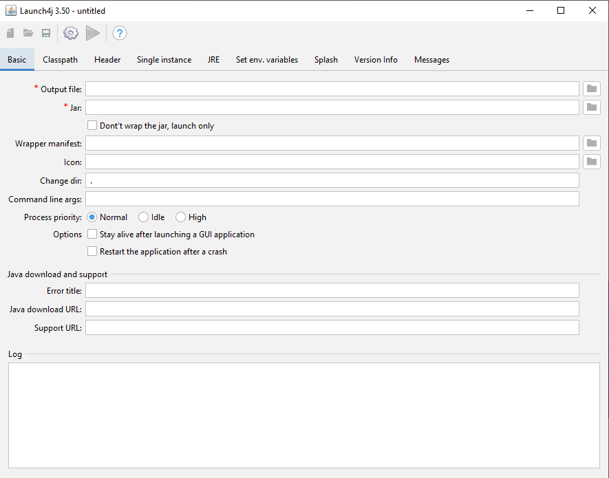
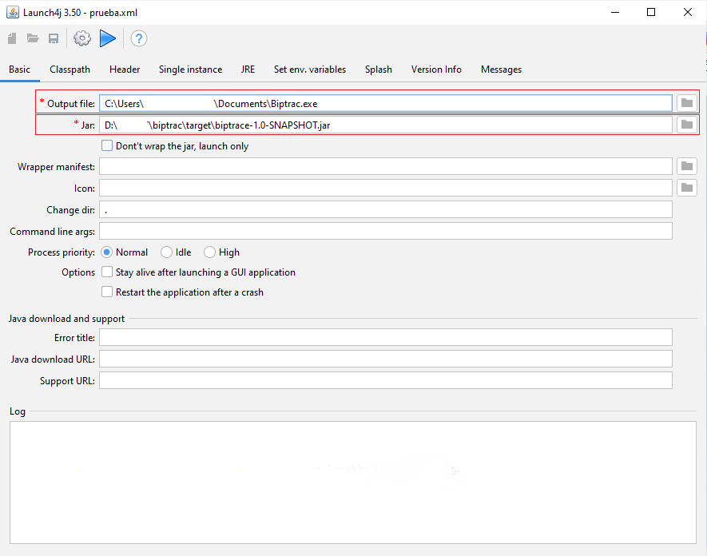
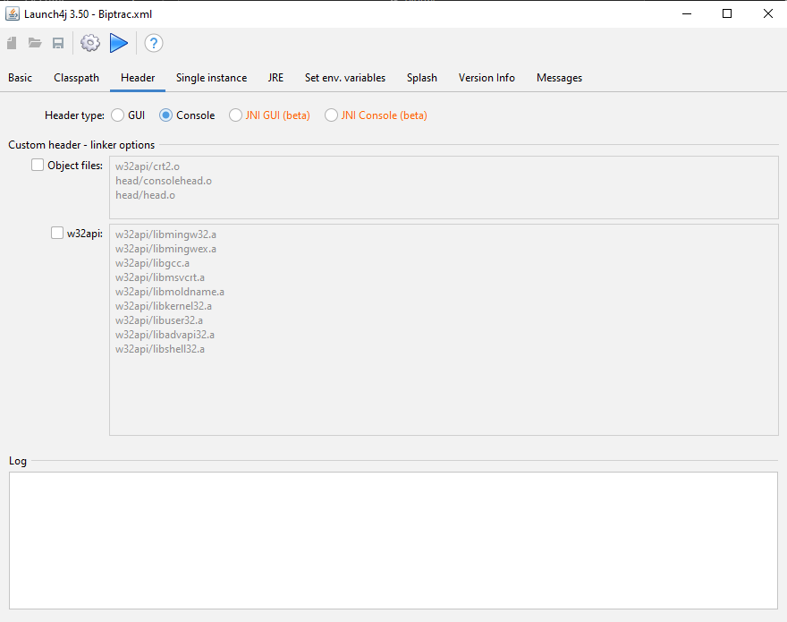
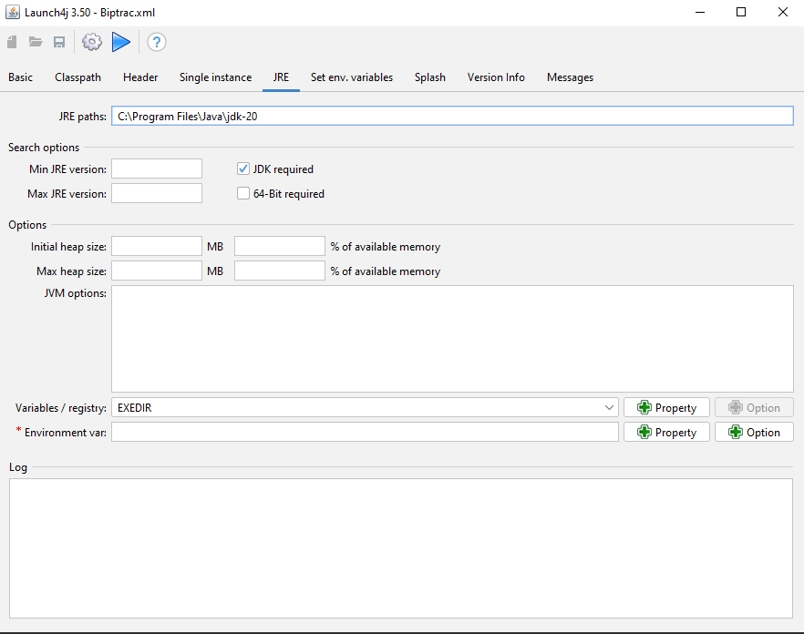
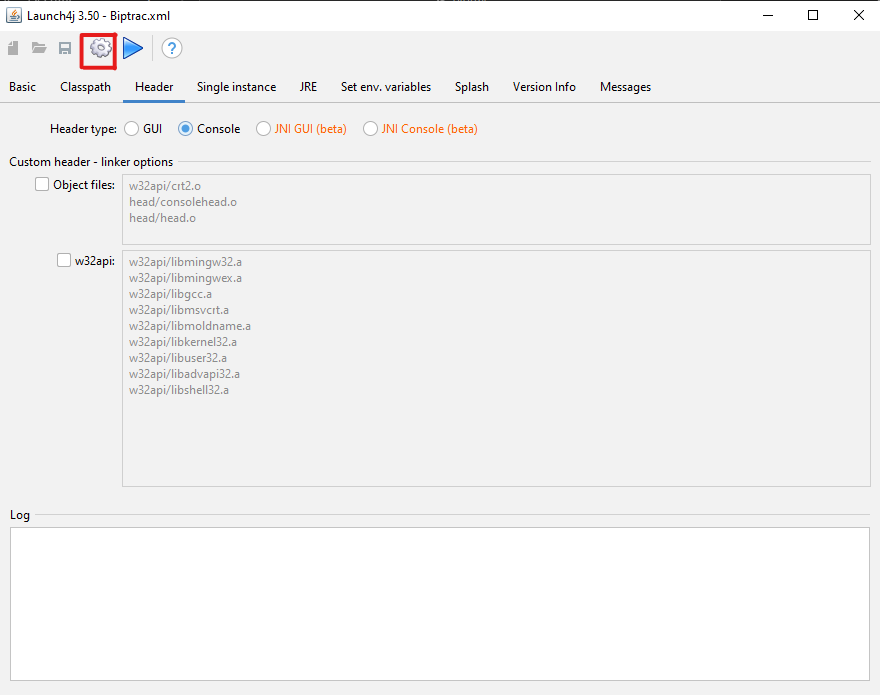
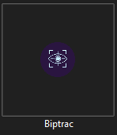
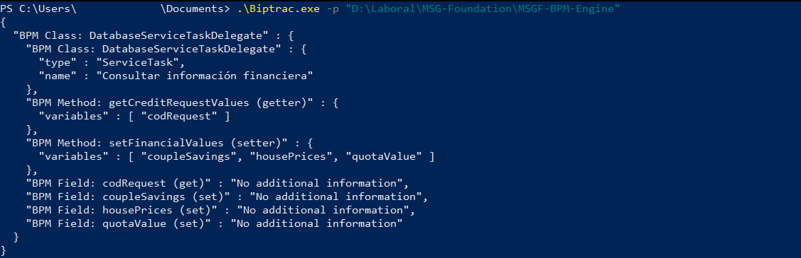
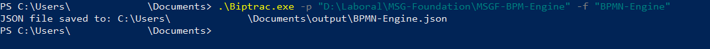

# Biptrac
The **B**us**i**ness **P**rocess **Trac**eability - **Biptrac** project is a framework for improving the evolution of business process-based software.

Biptrac has the possibility to visualize the results in the command console or, if the user likes, to generate a JSON file with the results.

## Index
- [Description](#description)
- [Requirements](#requirements)
- [Generate executable](#generate_executable)
- [Usage](#usage)

## Description 

**Biptrac** is a software that allows the traceability of the information of a **BPMN**(Business Process Management Notation) process model through the source code.

## requirements

To create the executable, make sure you have the following requirements:

1. **Maven**: for the creation of projects. [Official Website](https://maven.apache.org/download.cgi)
2. **Java**: It is used to define and configure the properties of the application you are converting into a native Windows executable. [Official Website](https://www.oracle.com/java/technologies/javase/jdk20-archive-downloads.html) 
3. **Launch4j**: for packaging java projects in .exe files. [Official Website](https://sourceforge.net/projects/launch4j/)

## Generate Executable

The **Biptrac executable** is achieved through the free software **Launch4J** dedicated to the generation of executables for **maven projects**. 



Once the **launch4j** software is available, the **Biptrac repository** is cloned.

````git
    git clone https://github.com/BPMN-sw-evol/biptrac.git
````

Inside the newly cloned Biptrac folder using the **command console** we use the following command, in order to generate a packaging of the **.jar** project

````mvn
    mvn clean package
````

Once the packaging of the **.jar** project is created, we proceed to open the **Launch4j software** and fill in only the **Output file** and **jar** fields in the **Basic section** and then check the **Console** option in the **Header section**.

*(In case we want to give an *icon* to the executable we proceed to look for the img in the **Icon field**)*
    
    

After checking the **Console option** in the **Header section**, we proceed to place **the path to the JDK** that we manage on the computer in the **JRE section**.
    

finally we click on **Build Wrapper** to build the executable
    

**Executable**        



## Usage

**Result by Console**
In the folder where we saved the executable, we open a **command console** and execute the following command

````cmd
.\Biptrac.exe -p "ProjectPath"
````


**Result by JSON file**
In the folder where we saved the executable, we open a **command console** and execute the following command

````cmd
.\Biptrac.exe -p "projectPath" -f "outputFileName"
````


